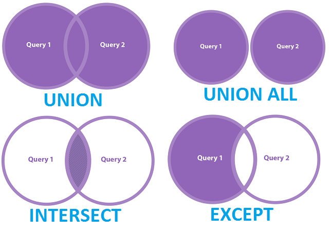

# Lesson 3

## Group by


```sql
/* 
    Mệnh đề GROUP BY trong SQL Server cho phép bạn sắp xếp các hàng của truy vấn theo nhóm. Các nhóm được xác định bởi các cột mà bạn chỉ định trong mệnh đề GROUP BY. 
    Thông thường, GROUP BY được sử dụng để tính tổng theo điều kiện, đếm bản ghi thỏa mãn điều kiện nào đó hoặc tìm dữ liệu sum, min, max..
    */

SELECT [list_column], agg()
FROM <db_name>.<schema_name>.<table_name>
WHERE ...
GROUP BY [list_column]

```

## Having
```sql
/*
    Mệnh đề Having kết hợp với group by cho phép lọc điều kiện sau kết quả truy vấn	nếu điều kiện đó là True.
    
    Cả where và having đều cho phép lọc bản ghi. Tuy nhiên, sự khác biệt giữa having và where nằm ở thứ tự thực thi trong câu lệnh khi lấy group by làm mốc. 
    Where cho lọc bản ghi trước truy vấn còn having là lọc sau truy vấn
*/
SELECT [list_column], agg()
FROM <db_name>.<schema_name>.<table_name>
WHERE ...
GROUP BY [list_column]
HAVING agg()...


```

## Union, Except, Intersect



```sql
-- Union/ union all
SELECT column1, column2
FROM table1
UNION/ UNION ALL
SELECT column1, column2
FROM table2

-- Except
SELECT column1, column2
FROM table1
EXCEPT
SELECT column1, column2
FROM table2

-- Intersect
SELECT column1, column2
FROM table1
INTERSECT
SELECT column1, column2
FROM table2

Note: muốn sử dụng được 4 mệnh đề trên:
1. các câu lệnh phải đồng nhất với nhau về số lượng cột trả về và kiểu dữ liệu
2. tên hiển thị luôn là tên của câu truy vấn số 1
```

## Case When

```sql
-- Case When
SELECT column1, column2,
    CASE
        WHEN condition1 THEN result1
        WHEN condition2 THEN result2
        ELSE result3
    END AS new_column
FROM table_name
WHERE ...

Note:
1. Giá trị sau THEN phải đồng nhất với nhau về kiểu dữ liệu
2. case when ưu tiên xử lý từ trên xuống dưới, 1 bản ghi khi duyệt qua case when chỉ nằm trong 1 nhóm và ưu tiên xử lý vào when được khai báo trước
3. có thể sử dụng case when lồng nhau nhiều lần:
    case
    when condition1 then 
        case
        when condition2 then...
        end
    end
4. ELSE trong case when có thể có hoặc không

```

## Function
```sql

/* String */

SELECT LEFT(column_name, length) --- cắt chuỗi từ trái sang
FROM table_name
WHERE ...

-- Right
SELECT RIGHT(column_name, length) --- cắt chuỗi từ phải sang
FROM table_name
WHERE ...

-- Substring
SELECT SUBSTRING(column_name, start_position, length) --- cắt chuỗi từ vị trí start_position với độ dài length
FROM table_name
WHERE ...

-- Len
SELECT LEN(column_name) --- trả về độ dài của chuỗi
FROM table_name
WHERE ...

-- Concatenation
SELECT CONCAT(column1, column2) AS concatenated_column -- nối nhiều chuỗi thành 1 chuỗi
FROM table_name
WHERE ...

-- Charindex
SELECT CHARINDEX('search_string', column_name) AS position -- tìm vị trí của chuỗi bé trong chuỗi lớn
FROM table_name
WHERE ...

-- CONCAT_WS
SELECT CONCAT_WS(',', column1, column2, column3) AS concatenated_column -- nối các chuỗi với dấu phẩy làm dấu phân cách
FROM table_name
WHERE ...

/* Date/ datetime*/
-- Get current date and time
SELECT GETDATE() AS current_datetime
FROM table_name
WHERE ...

-- Year
SELECT YEAR(column_name) AS year
FROM table_name
WHERE ...

-- Month
SELECT MONTH(column_name) AS month
FROM table_name
WHERE ...

--- round:" làm tròn số

SELECT ROUND (column_name,3)
FROM table_name
Where...;

--ceiling: lấy mức trần của 1 số
SELECT CEILING (column_name)
FROM table_name
Where...;

--floor: lấy mức sàn của 1 số
SELECT FLOOR (column_name)
FROM table_name
Where...;


```
## Cast, Convert
```sql
-- Cast
SELECT CAST(column_name AS data_type) AS new_column -- biến đổi kiểu dữ liệu mới
FROM table_name
WHERE ...

-- Convert
SELECT CONVERT(data_type, column_name) AS new_column -- chuyển đổi kiểu dữ liệu
FROM table_name
WHERE ...


```
## Alias

Trong Sql alias có tác dụng đặt lại tên cho 1 cột, 1 bảng trong câu lệnh

```sql
-- Alias
SELECT column_name AS alias_name
FROM table_name AS alias_table
WHERE ...

```

[Link Documents](https://www.w3schools.com/sql/func_sqlserver_convert.asp)