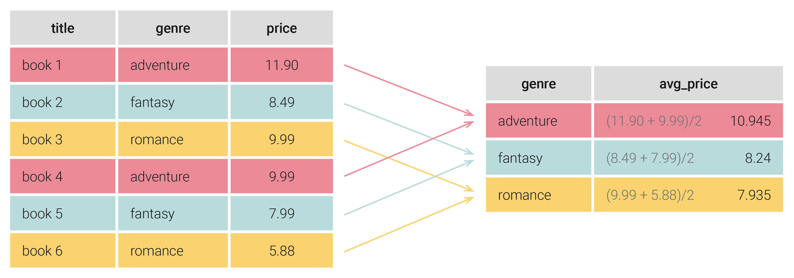

# Lesson 3

## Group by




```sql
/* 
    Mệnh đề GROUP BY trong SQL Server cho phép bạn sắp xếp các hàng của truy vấn theo nhóm. Các nhóm được xác định bởi các cột mà bạn chỉ định trong mệnh đề GROUP BY. 
    Thông thường, GROUP BY được sử dụng để tính tổng theo điều kiện, đếm bản ghi thỏa mãn điều kiện nào đó hoặc tìm dữ liệu sum, min, max..
    */

    SELECT [list_column], agg()
    FROM <db_name>.<schema_name>.<table_name>
    WHERE ...
    GROUP BY [list_column]

```

## Having
```sql
/*
    Mệnh đề Having kết hợp với group by cho phép lọc điều kiện sau kết quả truy vấn	nếu điều kiện đó là True.

    Cả where và having đều cho phép lọc bản ghi. Tuy nhiên, sự khác biệt giữa having và where nằm ở thứ tự thực thi trong câu lệnh khi lấy group by làm mốc. Where cho lọc bản ghi trước truy vấn còn having là lọc sau truy vấn
*/
    SELECT [list_column], agg()
    FROM <db_name>.<schema_name>.<table_name>
    WHERE ...
    GROUP BY [list_column]
    HAVING agg()...


```
