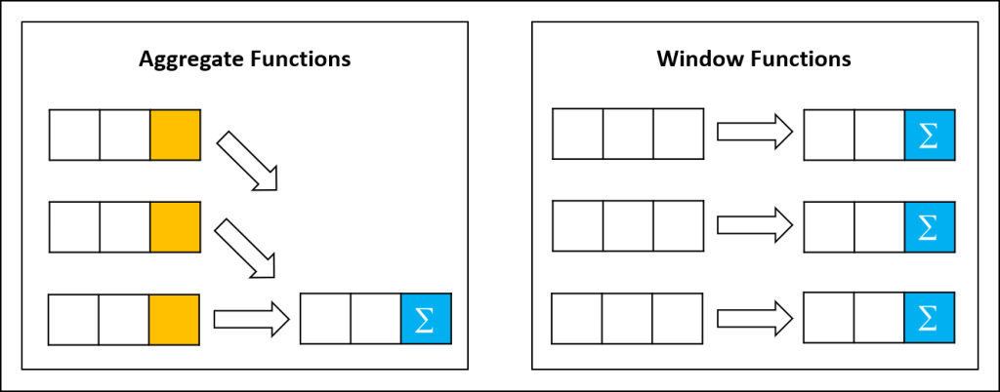

# Lesson 5

## Window function


```sql
--row_number
SELECT *,
    ROW_NUMBER() OVER (PARTITION BY column_name ORDER BY order_column) AS row_num
FROM table_name;

-- rank
SELECT *,
    RANK() OVER (PARTITION BY column_name ORDER BY order_column) AS rank_num
FROM table_name;

-- sum partition
SELECT *,
    SUM(column_name) OVER (PARTITION BY partition_column ORDER BY order_coulmn) AS sum_partition
FROM table_name;

-- max partition
SELECT *,
    MAX(column_name) OVER (PARTITION BY partition_column ORDER BY order_column) AS max_partition
FROM table_name;

current row: dòng hiện tại
preceding: các dòng bên trên của dòng hiện tại
following: các dòng bên dưới của dòng hiện tại

```
[Link Window function](https://datapot.vn/windows-functions-trong-sql-va-ung-dung-cua-no/)

## Join Statement


```sql
-- left join
SELECT *
FROM table1
LEFT JOIN table2 ON table1.column_name = table2.column_name;

-- right join
SELECT *
FROM table1
RIGHT JOIN table2 ON table1.column_name = table2.column_name;

-- inner join
SELECT *
FROM table1
INNER JOIN table2 ON table1.column_name = table2.column_name;

-- full join
SELECT *
FROM table1
FULL JOIN table2 ON table1.column_name = table2.column_name;

```