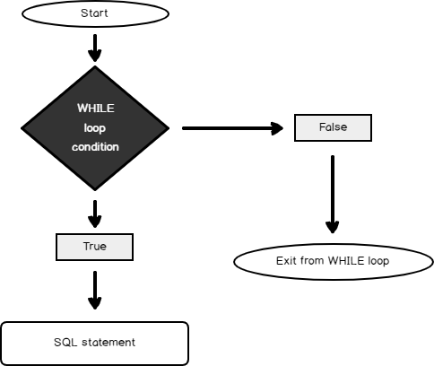

# Lesson 7


## IF else


```sql
-- câu điều kiện chia nhánh if else
IF 1=1
    BEGIN
        print('pass')
    END
ELSE
    BEGIN
        print('not pass')
    END


```
## Dynamic code
```sql
-- khai báo biến trong sql server
DECLARE @myVariable INT;
SET @myVariable = 10;

PRINT(@myVariable)

--- dynamic code

DECLARE @dynamicSQL NVARCHAR(MAX);
SET @dynamicSQL = N'SELECT * FROM YourTable WHERE ColumnName = ' + CAST(@myVariable AS NVARCHAR(10));

EXEC sp_executesql @dynamicSQL;

---

DECLARE @myVar varchar(8) = 'store 1'

SELECT *
FROM <Table>
WHERE COL = @myVar


```

## Loop



```sql
-- vòng lặp (loop) trong sql server

drop table if exists #a;
create table #a
(id int,
[description] varchar(32)
)
;
	

declare @i int = 1;

while @i <= 100000
	begin
		insert into #a 
		values (@i,'value so ' + cast(@i as varchar(32)));
		if @i >= 1000
			break;
	set @i += 1;
	--set @i = @i + 1;
	end
;


```

## Function

```sql

use MCIDB
go

DROP FUNCTION IF EXISTS dbo.fn_max_value
SET ANSI_NULLS ON
GO
SET QUOTED_IDENTIFIER ON
GO
CREATE function dbo.fn_max_value(@store varchar(10))
returns  float
as

	begin
		declare @i float;
		select @i = max(lcy_amt) from mcidb..BANHANg where STOREDID = @store
	return @i ;
end

select dbo.fn_max_value('store 1')


```
## Procedure

```sql

create procedure dbo.usp_fisrt_procedure -- tạo thủ tục
as
begin

	print 'start code';
	select top 100 * 
	from  mcidb..CUSTOMER;

	select top 100 * 
	from mcidb..BANHANG
	where STOREDID = 'store 2'
	;

	print('end code');

end
;

```